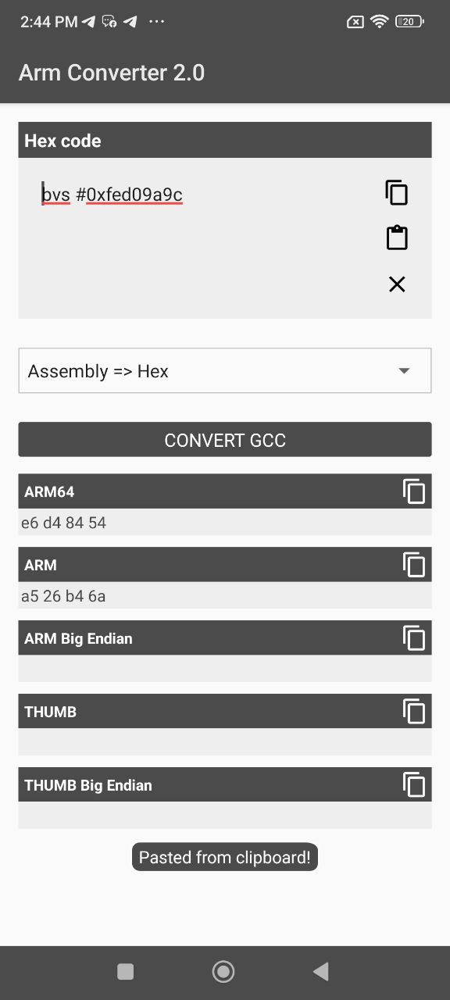

# Arm-Converter-Offline-apk  
### #ArmConverter

**Arm Converter Offline** is an Android tool designed to **convert HEX ⇄ ARM** instructions.  
Supports **all ABIs (arm64, armv7, x86, x86_64)** and works **completely offline**.

---

## How It Works

Arm Converter Offline uses native JNI logic and integrates two open-source engines:  

- [Capstone Engine](https://github.com/capstone-engine/capstone) – for disassembly (HEX → ARM)  
- [Keystone Engine](https://github.com/keystone-engine/keystone) – for assembly (ARM → HEX)  

Everything runs natively on Android — **no PC required**.

---

## Features

- Convert HEX → ARM and ARM → HEX  
- Supports all ABIs  
- Works offline  
- Built with JNI (C/C++ native layer)  
- Simple and lightweight Android UI  

---

## Requirements

- Android device  
- Basic assembly knowledge  
- Android 7.0+ recommended  

---

## Screenshots

| HEX TO ARM | ARM TO HEX |
|-------------|-------------|
|  |  |

---

## 📜 License

This project is licensed under the [Apache License 2.0](LICENSE).  
You are free to use, modify, and distribute this software under the terms of the Apache License.

---

**Developed by [ANTIK_YT](https://github.com/aantik-mods)**  
> “Convert Patch Build All Offline
